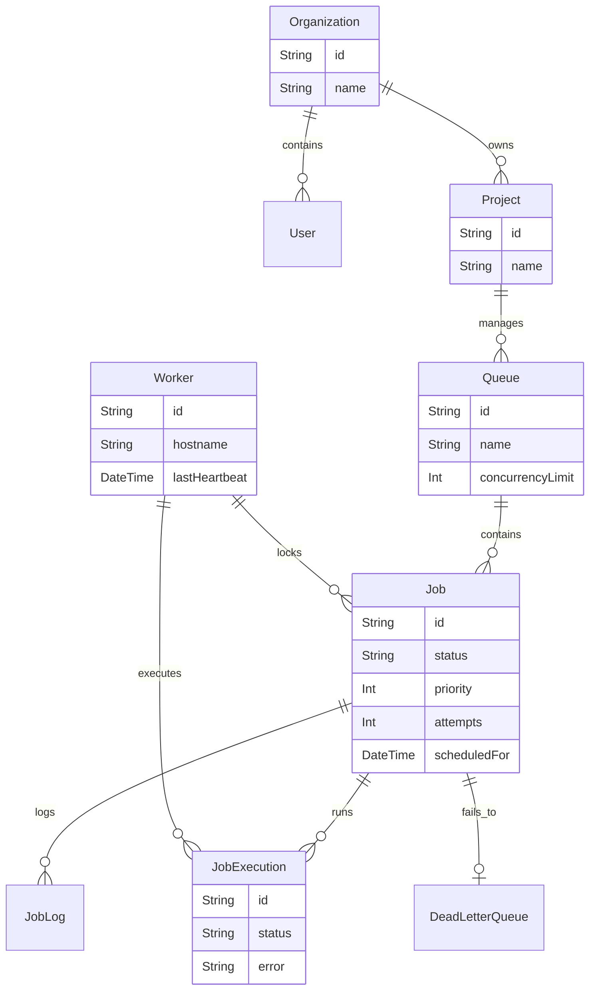

# 🚀 Distributed Job Scheduler

A production-inspired distributed job scheduling platform capable of reliably executing asynchronous background jobs across multiple workers. Built as a unified Next.js monorepo with a focus on engineering quality, reliability, and clean architecture.

---

## 📖 Quick Documentation Links
- **[Full REST API Reference](./api_docs.md)** — Detailed endpoint specifications, curl examples, and auth parameters.
- **[Architecture & Design Decisions](./design.md)** — Relational database normalization, performance indices, cascading delete strategy, and trade-offs.

---

## ✨ Features

### Core Scheduling
- **Immediate Jobs** — Execute as soon as a worker is available
- **Delayed Jobs** — Schedule jobs to run after a specified delay (`delayMs`)
- **Recurring Jobs** — Full cron expression support (`0 * * * *`)
- **Batch Jobs** — Spawn multiple jobs via the REST API in sequence

### Reliability & Concurrency
- **Atomic Job Claiming** — Workers use database-level locking to guarantee no two workers ever execute the same job
- **Configurable Retry Strategies** — Fixed, Linear, and Exponential backoff with configurable delays and max attempts
- **Dead Letter Queue (DLQ)** — Permanently failed jobs are archived for inspection and manual retry
- **Graceful Shutdown** — Worker drains all in-flight jobs before exiting on SIGINT/SIGTERM

### Observability
- **Job Execution Logs** — Every attempt is recorded with timestamps, status, and error messages
- **Worker Heartbeats** — Workers send a heartbeat every 10s; dashboard shows live ACTIVE/OFFLINE status
- **Execution Metrics** — Real-time counts for Queued, Running, Completed, Failed, and DLQ jobs

### Dashboard
- **Live Dashboard** — Polls APIs every 3 seconds for near-real-time updates
- **Queue Explorer** — Filter jobs by queue and status
- **Retry UI** — One-click retry for failed jobs directly from the dashboard
- **Worker Monitor** — See all registered workers and their health status

---

## 🏗️ System Architecture

GitHub natively renders this diagram. If it does not display, ensure you are viewing it directly on GitHub.

```mermaid
graph TD
    Client[Web Dashboard / REST Clients] -->|HTTP| API[Next.js API Routes]
    
    sublayer API
        API -->|POST /jobs| DB[(SQLite Database)]
        API -->|GET /queues| DB
    end

    WorkerService[Worker Process / ts-node] -->|Polls| DB
    WorkerService -->|Heartbeat| DB
    WorkerService -->|Executes Job| JobExecution[Job Execution Logic]
    JobExecution -->|Updates Status| DB
    JobExecution -->|Retries on failure| DB
    JobExecution -->|Sends to DLQ on max attempts| DB
```

---

## 🗄️ Database Design (ER Diagram)

This schema uses a fully normalized relational schema (10 tables) for multitenancy and robust execution tracking.



---

## 📡 REST API Quick-Start

For a full endpoint walkthrough, check out the **[REST API Reference](./api_docs.md)**.

| Method | Endpoint | Description |
|---|---|---|
| `GET` | `/api/queues` | List all queues with job counts |
| `POST` | `/api/queues` | Create a queue |
| `GET` | `/api/jobs` | List jobs (filter by `queueId`, `status`) |
| `POST` | `/api/jobs` | Create an immediate or delayed job |
| `POST` | `/api/jobs/cron` | Create a recurring cron job |
| `POST` | `/api/jobs/retry` | Retry a permanently failed job |
| `GET` | `/api/workers` | Get workers + system health stats |

---

## 🛠️ Setup & Running Locally

### Prerequisites
- Node.js 18+
- npm

### 1. Install Dependencies
```bash
npm install
```

### 2. Setup the Database
```bash
npx prisma db push
npx prisma generate
```

### 3. Seed the Database
```bash
npx ts-node src/lib/seed.ts
```

### 4. Start the Web Server (Terminal 1)
```bash
npm run dev
```
Open [http://localhost:3000](http://localhost:3000) to view the live dashboard.

### 5. Start the Background Worker (Terminal 2)
```bash
npx ts-node src/worker.ts
```
The worker will register, begin polling for jobs, and process them concurrently.

### 6. Run Automated Tests
```bash
npx vitest run
```

---

## 📁 Project Structure

```
├── prisma/
│   └── schema.prisma          # Full relational schema (10 models)
├── src/
│   ├── app/
│   │   ├── page.tsx           # Dashboard UI (React + TailwindCSS)
│   │   └── api/
│   │       ├── queues/        # Queue management
│   │       ├── workers/       # Worker health & stats
│   │       └── jobs/          # Job creation, cron, retry
│   ├── lib/
│   │   ├── prisma.ts          # Prisma client singleton
│   │   └── seed.ts            # Database seed script
│   └── worker.ts              # Background worker service
├── tests/
│   └── scheduler.test.ts      # Automated tests (Vitest)
├── api_docs.md                # Full API documentation
├── design.md                  # Architecture & design decisions
├── architecture.mermaid       # System architecture source file
└── er_diagram.mermaid         # Database ER diagram source file
```

---

## 🧪 Tests

```
✓ tests/scheduler.test.ts (3 tests) 12ms
  ✓ should create a job successfully
  ✓ should simulate worker backoff calculation
  ✓ should transition a job to DLQ logic when max attempts reached

Test Files: 1 passed | Tests: 3 passed | Duration: 235ms
```
